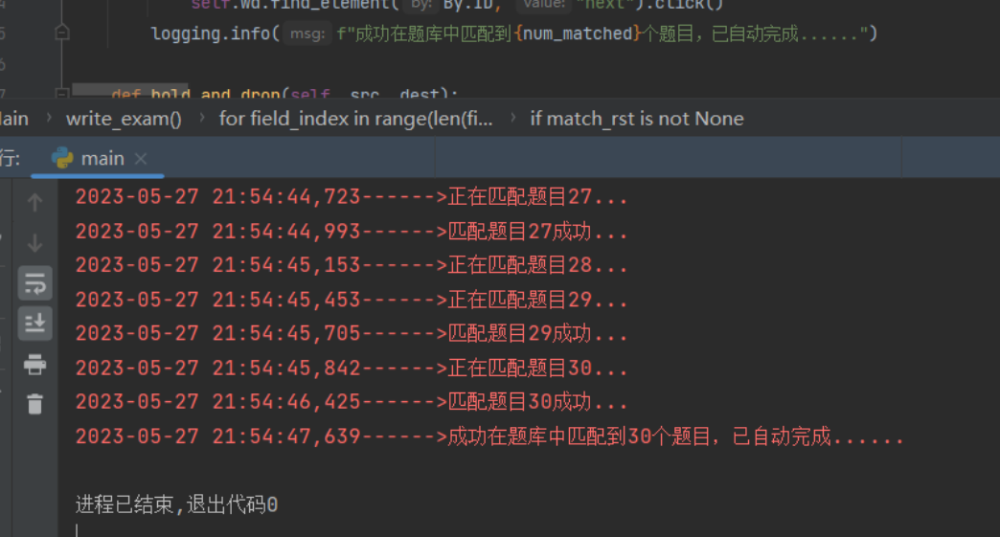
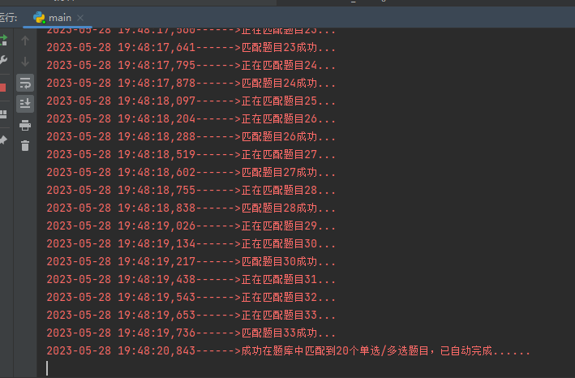
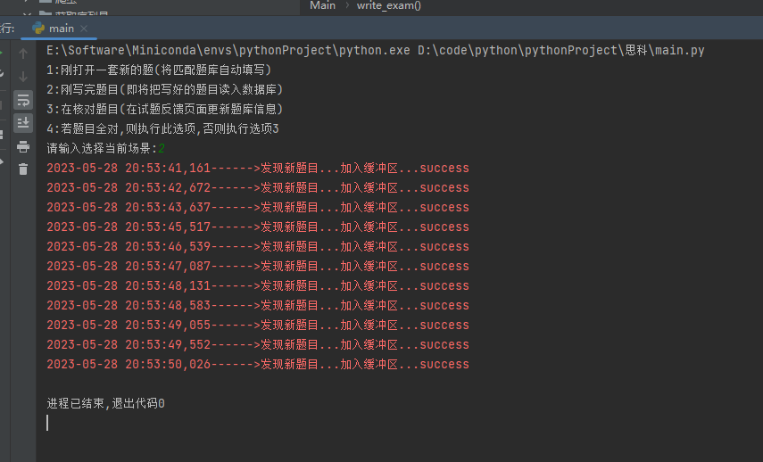
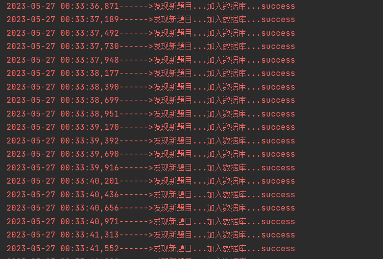

# README.md

## 写在最前

我看网上的博客有很多，但是都是要一个一个ctrl f，而且有的答案还是错的，就想着自己写个自动化的脚本。用的人越多，题库越强。当第一次做题30个时，往往第二次能匹配到二十余个(不带连线题).

## 待优化(不过勉强能用)

1. 可能遇到题目描述一样，但是图不一样的情况

   比如双绞线那个，暂时把这种题目略过了，以后遇到相同的情况加到代码里就好(记得去掉空格)

   ```python
   ignore_question_list = [
       '请参见图示。显示的是什么类型的布线？'
   ]
   ```

   解决思路：将图片的二进制文件也读进去，这样就可以避免这种情况

2. 连线题

   实际上代码没有问题，只不过是需要再界面处停留几秒，来不及改了，暂时停用连线题相关代码，要考试了

3. 之前调试的时候，不小心往数据库里存了一些重复数据，好在不多，后面有时间去下重
4. 数据库权限没设置好，安全隐患比较大，不过无所谓，应该没人会看到这个项目
5. 一些日志输入的格式比较乱

## 如何运行

参考https://github.com/D4wnnn/uestc_dxpx_auto_play

下载浏览器对应版本驱动-->将驱动放置与脚本同一目录下-->安装selenium库-->添加浏览器环境变量-->

执行`chrome.exe --remote-debugging-port=9222 --user-data-dir="D:/selenium_test"`-->

打开考试页面，运行脚本

比较简略，本来这个代码想着自己用用，所以写的很粗糙，若真有人找到这，有问题可以随时联系qq2638177031

## 运行效果









## 联系我

有问题可问qq2638177031

我的博客：https://blog.acdawn.cn